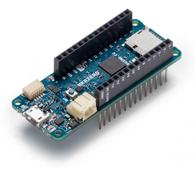
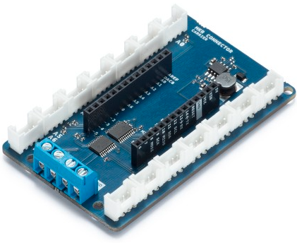

# Arduino-ClassTempo

Demo de la création d'une classe C++ permettant de réaliser des temporisations non bloquantes.

Présentation de la création d'un dépôt sur GitHub, applicable aux autres plateformes d'hébergement.

## Check list

- [x] Créer les fichiers sources
- [x] Créer la classe Tempo
- [x] Implémenter le programme de test pour la démo
- [x] Tester la classe Tempo sur la carte Arduino MKRZero
- [ ] Et maintenant, c'est à vous de jouer :stuck_out_tongue_winking_eye:

---

## Hardware

[Getting Started with the Arduino MKRZero](https://www.arduino.cc/en/Guide/ArduinoMKRZero)

|     [Arduino MKRZero Board](URL_MKRZero)     | [ARDUINO MKR CONNECTOR CARRIER](URL_MKR_CONNECTOR) (GROVE COMPATIBLE) |
| :------------------------------------------: | :-------------------------------------------------------------------: |
|  |     |

[URL_MKRZero]: https://www.arduino.cc/en/Main/ArduinoBoardMKRZero
[URL_MKR_CONNECTOR]: https://store.arduino.cc/arduino-mkr-connector-carrier

---

## Merci à la communauté des makers

* [Introduction Arduino](https://github.com/b2renger/Introduction_Arduino)
* [Le monde des objets, Des objets partout !](https://www.locoduino.org/spip.php?article87)
* [Le campus d'Eskimon sur Discord](https://eskimon.fr/) :wink:

### Open Source Hardware Association

<!--  -->

https://www.oshwa.org/
